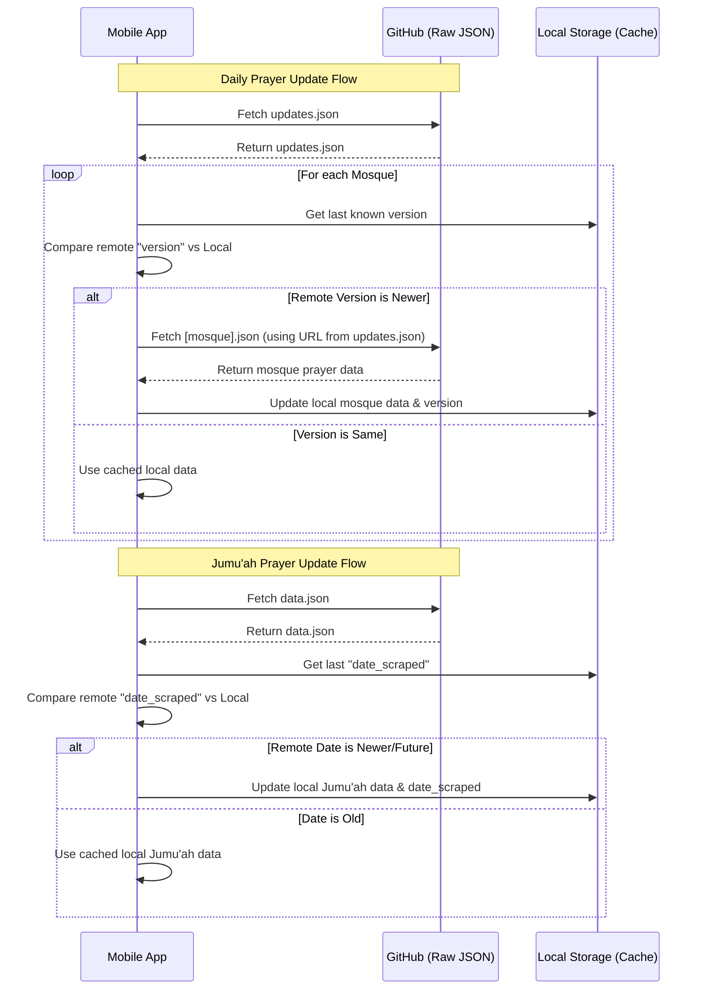

# Weekly Scraper & App Management

This repository handles the mosque iqamah data scraping and serves as the central configuration hub for the South Bay Iqamah mobile applications (iOS and Android).

## App Update System

The mobile apps use a remote configuration file hosted in this repository to check for updates upon launch. This allows for triggering update prompts without resubmitting to the App Store or Play Store.

### Configuration File
**File Path:** `version_config.json`  
**Raw URL:** `https://raw.githubusercontent.com/ahmednabulsi/weekly-scraper/refs/heads/main/version_config.json`

### JSON Structure
```json
{
  "ios": {
    "minimum_version": "1.0.0",
    "latest_version": "1.1.0",
    "recommended_message": "A new version is available with improvements.",
    "force_message": "A critical update is required.",
    "store_url": "https://apps.apple.com/app/idYOUR_ID"
  },
  "android": {
    "minimum_version": "1.0.0",
    "latest_version": "1.1.0",
    "recommended_message": "A new version is available with improvements.",
    "force_message": "A critical update is required.",
    "store_url": "https://play.google.com/store/apps/details?id=com.hormuz.southbayiqamah"
  }
}
```

### Update Logic & Triggering

The apps compare their installed version against the values in the JSON file using semantic versioning (e.g., `1.0.0`).

#### 1. "Must Update" (Forced/Required)
Triggered when the user's version is **lower than** the `minimum_version`.
*   **Behavior:** A blocking alert appears that cannot be dismissed. The only option is to click "Update" to go to the store.
*   **How to Trigger:** Increase `minimum_version` to be higher than the current user base (e.g., set to `1.1.0` to force all `1.0.0` users).

#### 2. "Recommended Update" (Optional)
Triggered when the user's version is **at or above** `minimum_version` but **lower than** `latest_version`.
*   **Behavior:** An alert appears with "Update" and "Later" buttons. The user can dismiss it and continue using the app.
*   **How to Trigger:** Keep `minimum_version` at the current level (e.g. `1.0.0`) but increase `latest_version` to the new release (e.g. `1.1.0`).

#### 3. No Update (Silent)
Triggered when the user's version is **equal to or higher than** `latest_version`.
*   **Behavior:** No alerts are shown.

---

## Mosque Data
The `.json` files in the root directory contain the scraped iqamah schedules for various mosques in the South Bay area. These are used by the mobile apps to display accurate prayer times.

---

## Pushing Updates to Mobile Users

To ensure that changes made to the data are reflected in the mobile applications, you must update specific versioning fields in the configuration files.

### 1. Friday Prayer Times and Speakers
Updates for Jumu'ah (Friday) prayers are managed in the `data.json` file.

*   **File Path:** `data.json`
*   **Required Action:** Modify the `date_scraped` field to a **future date/timestamp** (e.g., set it to the current date or the upcoming Friday).
*   **Why:** The mobile app checks this field; if the date in the remote file is newer than the last cached date on the device, the app will pull the fresh updates.

### 2. Daily Prayer Schedules
Updates for daily iqamah times are managed via individual mosque files and the central `updates.json` file.

*   **Step 1:** Modify the specific mosque JSON file (e.g., `mca.json`, `alnoor.json`) with the new times.
*   **Step 2:** Update the `updates.json` file.
    *   **Field:** `last_check` (Update to the current timestamp in UTC).
    *   **Field:** `version` for the specific mosque (e.g., `"mca": { "version": "2024.04.26" }`).
*   **IMPORTANT:** You **MUST** update the `version` value (e.g., `YYYY.MM.DD`). It can be any future date, and it is preferred to increment it by **+1 day** at a time for each update. If the `version` remains the same as what the user has locally, the mobile app will assume its data is already up-to-date and will **not** download the changes.

---

## Data Update Flow (Mobile Apps)

The following sequence diagram illustrates how the mobile applications (iOS/Android) check for and pull data updates from this repository.


